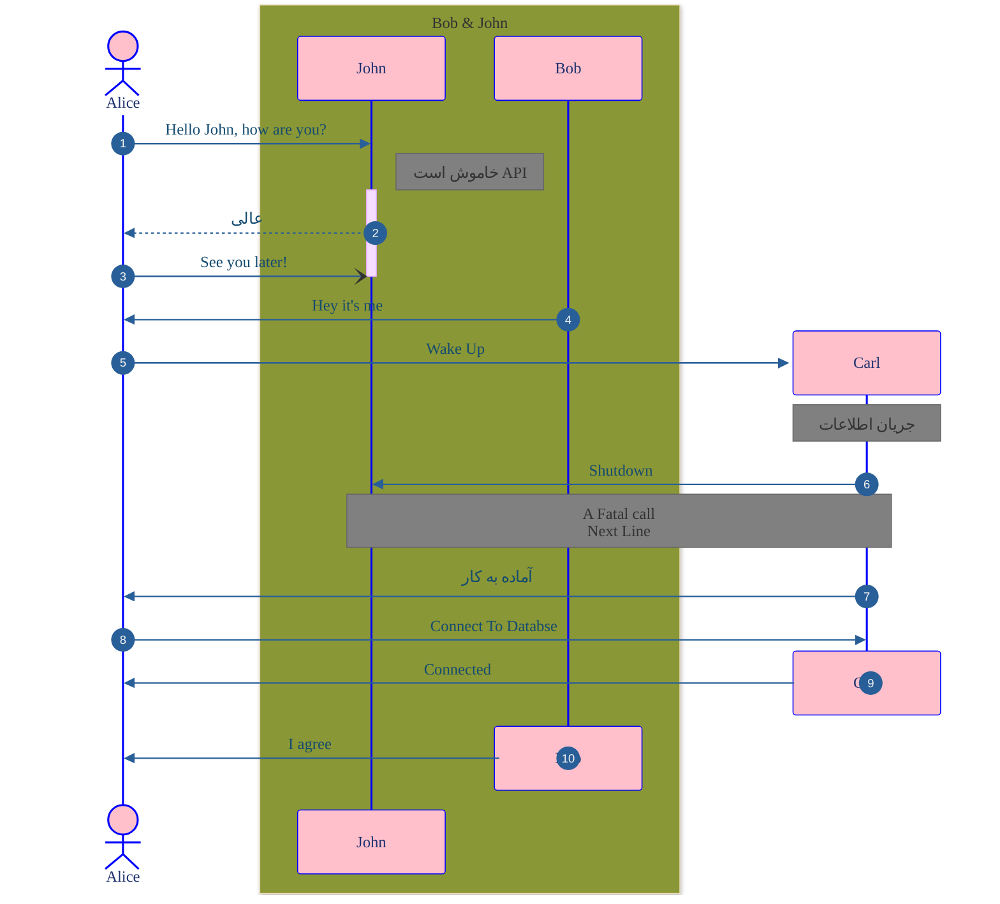
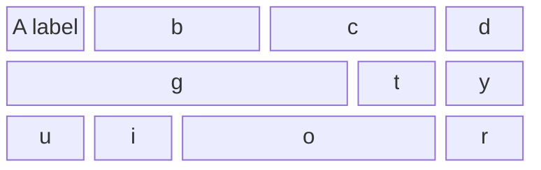
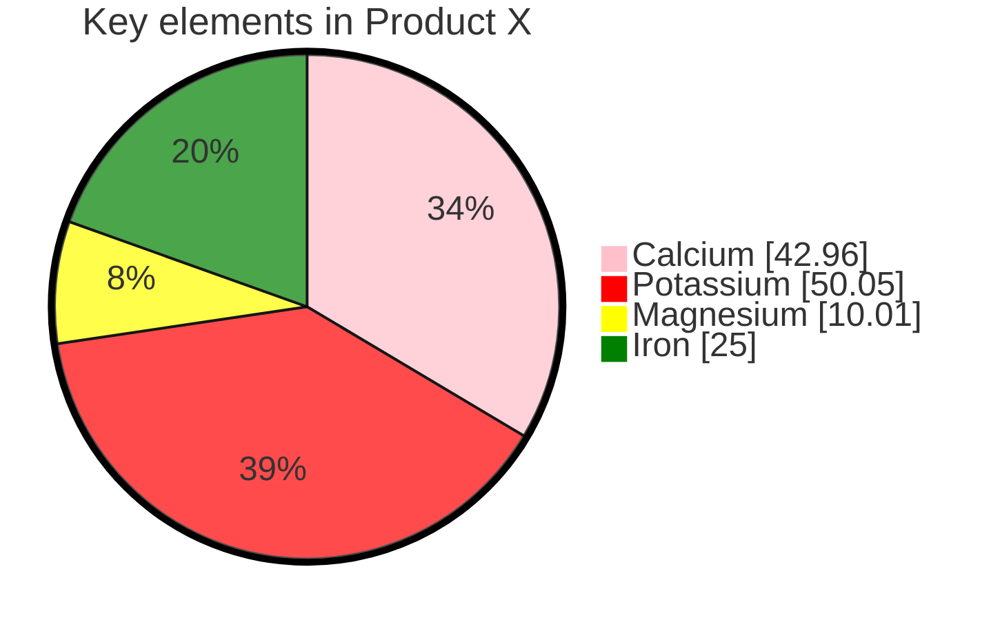

<!-------------------------------------------------------------------------------------->
<!-------------------------------------------------------------------------------------->

<!-- Awesome Font Linking -->

<!-- After the below linking now you can use Awesome-Fonts icons everywhere in your markdown file
even inside mermaid digrams
-->
<link
  href="https://cdnjs.cloudflare.com/ajax/libs/font-awesome/6.5.1/css/all.min.css"
  rel="stylesheet"
/>

<!-- Google Font Linking -->

<!-- After the below linking now you can use google fonts everywhere in your markdown file
even in mermaid. Here we import "Space Grotesk" & "Honk" font
-->
<link rel="preconnect" href="https://fonts.googleapis.com">
<link rel="preconnect" href="https://fonts.gstatic.com" crossorigin>
<link href="https://fonts.googleapis.com/css2?family=SUSE:wght@100..800&family=Space+Grotesk:wght@300..700&display=swap" rel="stylesheet">
<link href="https://fonts.googleapis.com/css2?family=Honk&family=Roboto+Mono:ital,wght@0,100..700;1,100..700&display=swap" rel="stylesheet">

<!-------------------------------------------------------------------------------------->
<!-------------------------------------------------------------------------------------->

<!-- Your Contents -->

<!-- <span> tag No.1 Start -->
<!-- With <span> tag you can specify the style
of whatever that is placed between <span></span>
-->
<span style="font-family:Space Grotesk,Vazir; font-weight: 100; font-size:16px; color:yellow">

# سلام Master

Hello And Welcome

مارک آنتونی با
<span style="font-size:16px; font-family:Georgia">
<ins>
System
</ins>
</span>
ها رابطه خوبی دارد
او ۳۳ سیستم دارد
.

<span style="font-size:16px; font-family:Verdana; color:green">
Now we wanna switch to english
and go to next line.
<br>Now new line
</span>

## توجه

در قسمت تنظیمات

```
mermaid
%%{ init:}
متغییر مهم
```

</span> 
<!-- span tag No.1 End -->

<!-- Mermaid JS Styling Guide -->

<!--
Styling Mermaid diagrams:
1. "Main Background" (Canvas) {color, border color&width, padding}:
      >>>>> Do it inside <style></style> tags <<<<<
2. Fonts {family-size},
   Nodes {background color(primaryColor),
          text color(primaryTextColor),
          border color(primaryBorderColor)}
   Texts Over Links (background color of the texts that are over Link lines)
         {secondaryColor}
   Links (Lines + Arrow Heads) {color(lineColor)}:
      >>>>> Do it Above the "graph TD" & inside %%{ init: { ... } }%% <<<<<
3. Links Lines (Lines Only NOT Arrow Heads)
         {link-line color(stroke), link-line thickness(stroke-width)}:
      >>>>> Do it Below the "graph LR" like this: linkStyle default stroke:#7C00FE,stroke-width:6px <<<<<
   A Specific Node {background color(fill),
                    border color(stroke),
                    border thickness(stroke-width)}:
      >>>>> Do it Below the "graph TD" like this: style A fill:#f9f,stroke:#333,stroke-width:4px <<<<<
-->

<!-- Mermaid Canvas Styling -->

<!-- With the below styling we can set the background style of any mermaid diagrams.
.mermaid means all the (html and markdown) mermaid diagrams in this file
.one means any (html only) mermaid diagram(s) containing the class "one" i.e. class="mermaid one"
-->
<style>
        .mermaid {
            background-color: #F6F193; /* Mermaid container background */
            border: 5px solid purple; /* Border style */
            padding: 20px; /* Padding */
            border-radius: 15px; /* Rounded corners */
        }
        .one {
            background-color: #E5DDC5; /* Mermaid container background */
            border: 5px solid #a18464; /* Border style */
            padding: 20px; /* Padding */
            border-radius: 15px; /* Rounded corners */
        }
</style>

<!-- HTML example of a Mermaid diagram -->

<div class="mermaid one">
%%{
  init: {
    'theme': 'base',
    'themeVariables': {
      'fontFamily': 'Honk,Vazir',
      'fontSize': '26px',
      'primaryColor': '#FF6868',
      'primaryTextColor': 'black',
      'primaryBorderColor': '#FAEF5D',
      'secondaryColor': '#7C00FE',
      'lineColor': '#FF0080'
    }
  }
}%%

flowchart LR

linkStyle default stroke:#7C00FE,stroke-width:4px
style AB fill:#f9f,stroke:#333,stroke-width:4px

A[Start] --> B{Is it working?}
B -- Yes --> C[Great!]
B -- No --> D[Fix it]
D --> B
C --> E[پایان]
F(شروع) ~~~ B

</div>
<br>

<br>

<!-- Markdown example of a Mermaid diagram -->

```mermaid
%%{
  init: {
    'theme': 'base',
    'themeVariables': {
      'fontFamily': 'Verdana,Vazir',
      'fontSize': '24px',
      'primaryColor': '#FF6868',
      'primaryTextColor': 'black',
      'primaryBorderColor': '#603F26',
      'secondaryColor': '#D8A25E',
      'tertiaryColor': 'pink',
      'tertiaryTextColor':'blue',
      'tertiaryBorderColor':'black'
    }
  }
}%%

%% This is a comment
---
config:
  look: handDrawn
  theme: neutral
---
flowchart TD

%% Styles
linkStyle default stroke:#9400FF,stroke-width:6px
style Goodbye fill:#f9f,stroke:#333,stroke-width:4px
%% End Styles

subgraph A [
گروه ۱
]
%% This is another comment
App("This is Emoji ❤️") --> Home --> Sidebar("fa:fa-car-battery ")
Home["`This is **markdown**`"] & App --> Message
end
%% subgraph A

subgraph Two
subgraph 3
Hello --ارتباط دوگانه----> Goodbye("مرغ char:#9829;")
end
%% subgraph 3
FF --"Link Text (✌️)"--> 88 --Longer Link----> App & 33
Goodbye & Hello --> 88{"A double quote:#quot;"}
end
%% subgraph Two

subgraph XP [Setting Direction]
direction LR
EE & HH & PQ;
Next("")
EE --> PQ
end
%% subgraph XP

No1
No2
No2 ~~~ Message
No1 --> No2 --> No2

A --> Two

```

## **_End of Graph Diagram_**

## Sequence Diagram



## ***End of Sequence Diagram***

## Block Diagram



## Pie Diagram


