<!--------------------------------------------------------------------------->
<!-- Setting MermaidJS Canvas Style -->

<!--------------------------------------------------------------------------->
<!--------------------------------------------------------------------------->

# Backend Architecture

Here we draw our Backend API architecture
using MermaidJS Library

## **SignUp** Process Sequence Diagram

```mermaid
%%{
  init: {
    'theme': 'base',
    'fontFamily': 'Itim,Vazir',
    'sequence': {
      'showSequenceNumbers': true,
      'actorMargin': 60,
      'noteMargin': 10,
      'boxTextMargin': 10
    },
    'themeVariables': {
      'actorBkg':'#FABC3F',
      'actorBorder':'#7C00FE',
      'actorTextColor': '#000000',
      'signalColor':'#000000',
      'signalTextColor':'#000000',
      'noteBkgColor':'#D7BBF5'
    },
    'themeCSS': '.actor {font-size: 24px !important;};.noteText {font-size: 18px !important;};.messageText { font-size: 22px !important;}'
  }
}%%

sequenceDiagram

actor User

box rgb(138,151,54) API
participant server as server.js
participant auth.routes
participant auth.controller
participant user.model
participant generateToken
end

box rgb(138,151,54) Database
participant MongoDB
end

box rgb(138,151,54) Node Modules
participant bcrypt
end


User ->> server: /api/auth/signup
Note over User,server: {fullName, username, password,<br>gender,profilePic}
server ->> auth.routes: /signup
auth.routes ->> auth.controller: signup(req, res)
auth.controller ->> MongoDB: User.findOne({ username })
Note over auth.controller,user.model: User -> {fullName, username,<br>password,gender,profilePic}
Note over auth.controller,MongoDB: 🆗 (It's a new user thus can signup)
auth.controller ->> bcrypt: Hash the "password"
Note over auth.controller,bcrypt: 🆗 Hashed
auth.controller ->> user.model: Create the user model
Note over auth.controller,user.model: 🆗Databse-Ready User Model
auth.controller ->> generateToken: generateTokenAndSetCookie(newUser._id, res)
Note over auth.controller,generateToken: 🆗 res.cookie(...)
auth.controller ->> MongoDB: Save the User
Note over auth.controller,MongoDB: 🆗 Saved
auth.controller ->> User: 🆗 Successful Signup!


```

## **Login** Process Sequence Diagram

```mermaid
%%{
  init: {
    'theme': 'base',
    'fontFamily': 'Itim,Vazir',
    'sequence': {
      'showSequenceNumbers': true,
      'actorMargin': 60,
      'noteMargin': 10,
      'boxTextMargin': 10
    },
    'themeVariables': {
      'actorBkg':'#FABC3F',
      'actorBorder':'#7C00FE',
      'actorTextColor': '#000000',
      'signalColor':'#000000',
      'signalTextColor':'#000000',
      'noteBkgColor':'#D7BBF5'
    },
    'themeCSS': '.actor {font-size: 24px !important;};.noteText {font-size: 14px !important;};.messageText { font-size: 20px !important;}'
  }
}%%

sequenceDiagram

actor User

box rgb(138,151,54) API *.js
participant server as server.js
participant auth.routes
participant auth.controller
participant user.model
participant generateToken
end

box rgb(138,151,54) Database
participant MongoDB
end

box rgb(138,151,54) Node Modules
participant bcrypt
end

User ->> server: /api/auth/login
Note over User,server: {username, password}
server ->> auth.routes: /login
auth.routes ->> auth.controller: login(req, res)
auth.controller ->> MongoDB: User.findOne({ username })
Note over MongoDB,user.model: User -> {fullName, username,<br>password,gender,profilePic}
Note over auth.controller,MongoDB: 🆗 User Found
auth.controller ->> bcrypt: bcrypt.compare(<Login-Password>,<Database-Password>)
Note over auth.controller,bcrypt: 🆗 Passwords Match
auth.controller ->> generateToken: generateTokenAndSetCookie(user._id, res);
Note over auth.controller,generateToken: 🆗 res.cookie(...)
auth.controller ->> User: 🆗 res.status(200).json({...})


```

## **Logout** Process Sequence Diagram

## **Get Messages** Process Sequence Diagram

```mermaid
%%{
  init: {
    'theme': 'base',
    'fontFamily': 'Itim,Vazir',
    'sequence': {
      'showSequenceNumbers': true,
      'actorMargin': 60,
      'noteMargin': 10,
      'boxTextMargin': 10
    },
    'themeVariables': {
      'actorBkg':'#FABC3F',
      'actorBorder':'#7C00FE',
      'actorTextColor': '#000000',
      'signalColor':'#000000',
      'signalTextColor':'#000000',
      'noteBkgColor':'#D7BBF5'
    },
    'themeCSS': '.actor {font-size: 24px !important;};.noteText {font-size: 18px !important;};.messageText { font-size: 20px !important;}'
  }
}%%

sequenceDiagram

actor User

box rgb(138,151,54) API *.js
participant server as server.js
participant message.routes
participant protectRoute
participant message.controller
participant conversation.model
end

box rgb(138,151,54) Node Modules
participant jsonwebtoken
end

box rgb(138,151,54) MongoDB
participant MongoDB
end

User ->> server: /api/messages/:id
server ->> message.routes: /:id
Note over server,message.routes: get("/:id", >>>> protectRoute <<<<<br>, getMessages)
message.routes ->> protectRoute: protectRoute(req, res, next)
protectRoute ->> jsonwebtoken: jwt.verify(<User token>, <env SECRET>)
Note over protectRoute,jsonwebtoken: 🆗 Decoded
protectRoute ->> MongoDB: User.findById(<Decoded User ID>).select("-password")
Note over protectRoute,MongoDB: 🆗 User Found
Note over protectRoute: <User Side> req.user = user <Database Side>
protectRoute ->> message.routes: next()
Note over protectRoute,message.routes: get("/:id", protectRoute,<br> >>>> getMessages <<<<)
message.routes ->> message.controller: getMessages(req, res)
Note over message.controller: const { id: userToChatId } = req.params
Note over server,message.controller: /api/messages/:id ➡️ /:id ➡️ req.params
Note over message.controller: const senderId = req.user._id
Note over protectRoute,message.controller: req.user from protectRoute:<br>req.user = user<br><User Side> = <Database Side>
message.controller ->> MongoDB: Conversation.findOne({participants:{$all...},}).populate("messages")
Note over conversation.model,MongoDB: Conversation Model:<br>{participants:[{type: ObjectId,ref: "User",},],<br>messages:[{type: ObjectId,ref:"Message",},]}
message.controller ->> User: 🆗 res.status(200).json(conversation.messages)

```

