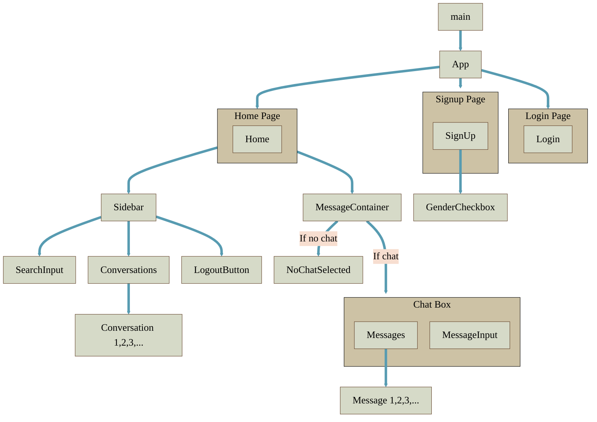

<!--------------------------------------------------------------------------->
<!-- Setting MermaidJS Canvas Style -->

<!--------------------------------------------------------------------------->
<!--------------------------------------------------------------------------->

# Frontend Architecture

## React Pages & Components

